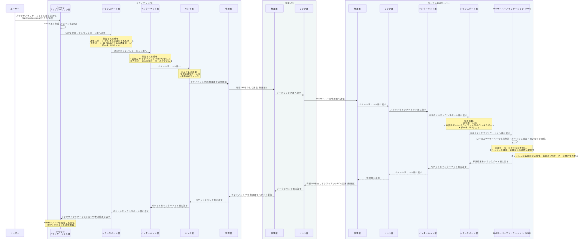

- tcpipの自身の理解度をもう少し図に書き溜めたいので、書いてみる with ChatGPT
- tcpipが語られる時、出発地点のクライアントPCと、最終目的であるサーバーの2つ間でしか表現されてないことがほとんどなので、もう少しその間の通信機器も図示しながら、tcpipの仕組みの理解度を高める

## ケース1

有線で接続しているPCからブラウザを使用して、httpリクエスト（http://www.hoge.co.jp/）を送って表示

## ケース2

無線でキャリア通信しているiPhoneを使用して、httpsリクエスト（https://www.google.co.jp/）を送って表示
